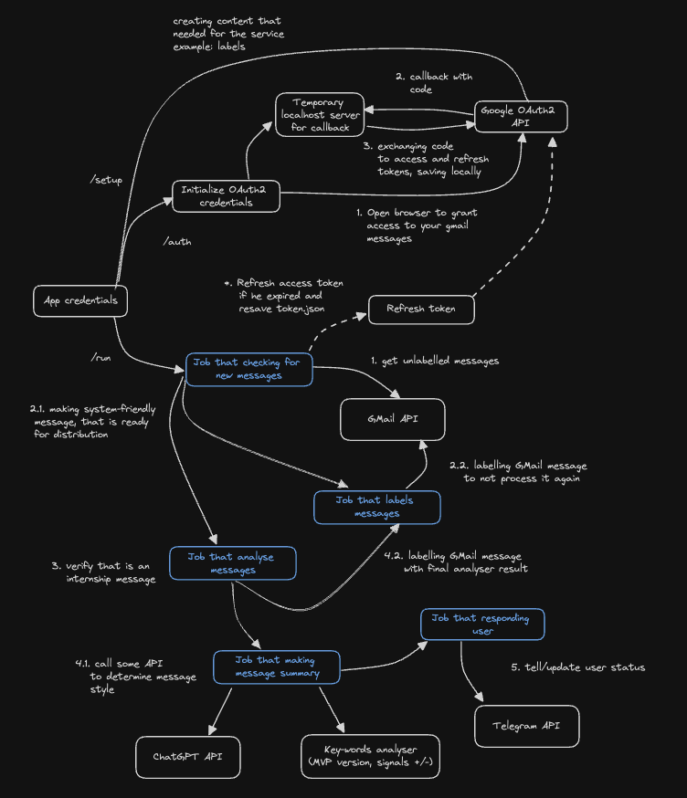

## i4u   

**Internship for you** is a lightweight and efficient solution designed to streamline the management of internship
requests.

This tool automates the process of identifying internship-related emails, summarizing them, and sending the summaries to
your designated Telegram channel.

It labels processed messages to prevent redundant processing, making it an essential assistant for internship seekers.

> [!NOTE]
> Core design, employs the principles of concurrency by utilizing goroutines, channels, and wait groups.
>
> This means that it can efficiently process multiple tasks simultaneously, which is analogous to how many real-world
> personal assistants handle multiple requests from their users at the same time.
>
> This makes i4u not just a tool for managing internship requests but also a fascinating example of how modern software
> development leverages concurrency to improve efficiency and responsiveness.
